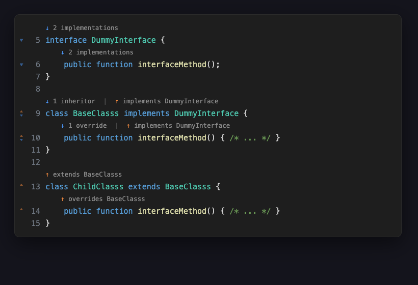
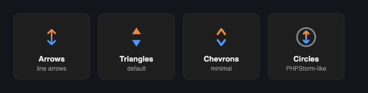

# PHP Hierarchy Lens

**See how your PHP classes relate — at a glance.** PhpStorm-style CodeLens and gutter
indicators for interface implementations, class inheritance, method overrides, and trait
usage. No language server required, no paywall.

## Why

Jumping between an interface and its implementations, or a method and the ones that
override it, usually means a "Find all references" detour. PHP Hierarchy Lens surfaces
those relationships **right where you're reading the code** — a clickable count above each
declaration and a colored arrow in the gutter — so navigating a class hierarchy is one
click, not a search.

It builds its own lightweight index of your workspace by parsing PHP directly, so it works
on its own — it doesn't depend on a paid language server, and it won't expire.

## Features

- **↓ Implementations** — on interfaces and interface/abstract methods: who implements this.
- **↓ Inheritors** — on classes: which subclasses extend this.
- **↓ Overrides** — on methods: which subclasses override this one.
- **↑ Parent link** — on a method/class: jump to the interface it *implements* or the parent
  it *overrides* / *extends*.
- **↓ Trait usages** — on traits: which classes `use` this trait.
- **Namespaces & traits** fully resolved (via `use` aliases and FQNs).
- **Two ways to see it:** clickable **CodeLens** text above the line, and **gutter icons**
  (up = orange, down = blue). Hover a declaration line for a popup that lists every related
  declaration as a jump link.

## Icon styles

Pick the gutter glyph set that fits your theme with `phpRelations.gutterIcons.style`:

## Settings

Find these under **Settings → Extensions → PHP Hierarchy Lens**.

| Setting | Default | What it does |
|---|---|---|
| `phpRelations.enable` | `true` | Master switch |
| `phpRelations.codeLens.enable` | `true` | Show CodeLens text |
| `phpRelations.gutterIcons.enable` | `true` | Show gutter icons |
| `phpRelations.gutterIcons.style` | `triangles` | `arrows` · `triangles` · `chevrons` · `circles` |
| `phpRelations.gutterIcons.opacity` | `50` | Icon opacity, `10`–`100` (%) |
| `phpRelations.gutterIcons.hover` | `true` | Show the hover popup |
| `phpRelations.gutterIcons.hoverLimit` | `15` | Max items in the popup |
| `phpRelations.indicators.implementations` | `true` | Toggle the implementations indicator |
| `phpRelations.indicators.inheritors` | `true` | Toggle the inheritors indicator |
| `phpRelations.indicators.overrides` | `true` | Toggle the overrides indicator |
| `phpRelations.indicators.parent` | `true` | Toggle the upward implements/overrides link |
| `phpRelations.indicators.traitUsages` | `true` | Toggle the trait-usage indicator |
| `phpRelations.exclude` | `["**/vendor/**"]` | Globs excluded from indexing |

## Using it

- **CodeLens** (text above the line) is clickable — it opens a peek with the targets.
- **Gutter icons** are visual markers. VS Code doesn't expose click/hover events for gutter
  icons themselves, so hover the **declaration line** next to the icon: a popup lists each
  related declaration as a jump link, with the count header to peek them all.

## Requirements

VS Code `^1.90.0`. Works in VS Code and Cursor (and other VS Code–compatible editors).

## Known limitations

- Relationships into excluded folders (e.g. `vendor`) aren't shown unless you index them.
- Members declared only via PHPDoc (`@method`, `@mixin`) aren't resolved — only real
  declarations in your workspace.

## License

[MIT](LICENSE.txt) © Giannis Gasteratos

---

*Not affiliated with, sponsored by, or endorsed by JetBrains. "PhpStorm" is a trademark of
JetBrains s.r.o., used here only to describe comparable functionality.*
